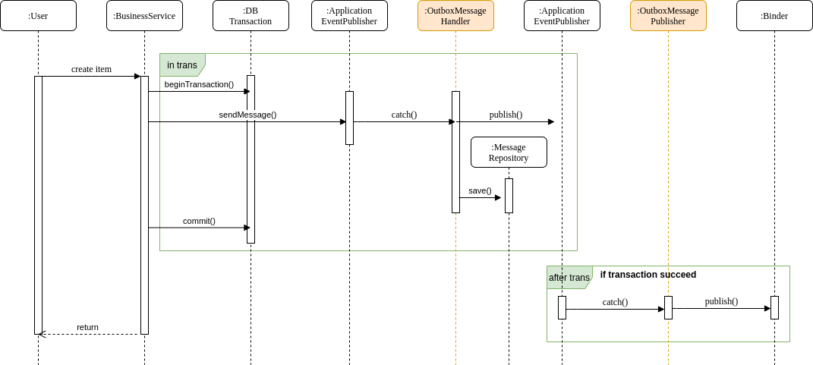

[](https://codecov.io/gh/dilaverdemirel/spring-cloud-stream-outbox-extension)


# Spring Cloud Stream Outbox Extension


This library provides an extension if you already use spring cloud stream with the transactional database for application messaging. 
This extension provides transactional messaging. It prevents message lost. If the transaction is succeed, it publishes the message to binder. 

If an error occurred when sending the message to the binder(for exp. RabbitMQ),Status of the message will be "FAILED". You can send the failed 
messages using the predefined scheduler service.

This extension saves all messages. But the message sends immediately when the transaction is succeeded. Only failed messages is sent through 
the scheduled job. So this extension mostly sends the messages on time. This method provides a high performance.

There are three steps;
* Send a message with the message wrapper object(OutboxMessageEvent) over spring **ApplicationEventPublisher**
* **OutboxMessageHandler** catches the message to save to DB in same transaction
* **OutboxMessagePublisher** catches and send the message to binder(RabbitMQ or Kafka) after the transaction complete

You can see sequence diagram below.



## What does do this extension?

- Sends the message on time safely
- Sends the messages in transactional integrity
- Saves all messages and tracks the message statuses
- Resend the failed messages
- Prevents the message lost 

## Usage

You should add the dependency below to pom.xml file.
```xml
<dependency>
  <groupId>com.dilaverdemirel.spring</groupId>
  <artifactId>spring-cloud-stream-outbox-extension</artifactId>
  <version>1.0-SNAPSHOT</version>
</dependency>
```

You should edit your configuration like below for activation the extension.

```java
@EnableJpaRepositories(basePackages = {
        "com.dilaverdemirel.spring.outbox.repository"
})
@EntityScan(basePackages = {
        "com.dilaverdemirel.spring.outbox.domain"
})
@ComponentScan({
        "com.dilaverdemirel.spring.outbox"
})
@SpringBootApplication
public class DemoApplication {
    public static void main(String[] args) {
        SpringApplication.run(DemoApplication.class, args);
    }
}
```

And then, you can send a message in transaction like below
```java
@Service
public class PaymentService {
    private final PaymentRepository paymentRepository;
    private final ApplicationEventPublisher applicationEventPublisher;

    public PaymentService(PaymentRepository paymentRepository,
                          ApplicationEventPublisher applicationEventPublisher) {
        this.paymentRepository = paymentRepository;
        this.applicationEventPublisher = applicationEventPublisher;
    }

    @Transactional
    public void doPayment(Payment payment) {
        paymentRepository.save(payment);
        final var outboxMessageEvent = OutboxMessageEvent.builder()
                .source("payment")
                .sourceId(payment.getId())
                .payload(payment)
                .channel("stockOperationOutputChannel")
                .build();

        applicationEventPublisher.publishEvent(outboxMessageEvent);
    }
}
```

You can resend the failed messages with FailedOutboxMessageSchedulerService, but you need to active the scheduler service.

At this point, you should be careful. Because, if your application running as multiple instance, this job causes that message to be sent duplicate.
To solve this problem, you should use a distributed scheduler like [that](https://github.com/dilaverdemirel/trendyol-scheduler-service).
```java
@Configuration
@EnableScheduling
public class DemoApplication {
    @Bean
    public FailedOutboxMessageSchedulerService failedOutboxMessageSchedulerService(){
        return new FailedOutboxMessageSchedulerService();
    }    
}
``` 

## Example Application
If you want to see how is work, there is an [example application](https://github.com/dilaverdemirel/trendyol-scheduler-service).

#### Notes

Logo [source](https://logodust.com/)